# Muaddib Platform — Technical Architecture

> Read from actual source code 2026-06-23. Not documentation — code.
> Previous version was documentation-only; this one is code-verified.

---

## Service Map

```
┌─────────────────────────────────────────────────────────────────────────────┐
│                       Cloudflare Workers                                    │
│                                                                             │
│  ┌──────────────────────┐  ┌──────────────────┐  ┌────────────────────┐   │
│  │   Muaddib Identity   │  │ Asset Excellence  │  │  Checklist Works   │   │
│  │  muaddib.app         │  │ ae.muaddib.app    │  │ checklist.muaddib  │   │
│  │  auth.muaddib.app    │  │                   │  │      .app          │   │
│  │  (same worker, 2     │  │  Clerk satellite  │  │  Clerk satellite   │   │
│  │   routes; primary +  │  │  of muaddib.app   │  │  of muaddib.app    │   │
│  │   admin satellite)   │  │                   │  │                    │   │
│  │  Clerk PRIMARY       │  │  React Query +    │  │  Dexie (IndexedDB) │   │
│  └──────────────────────┘  │  Realtime WS      │  │  + localStorage    │   │
│                             └──────────────────┘  │  offline queue     │   │
│                                                    └────────────────────┘   │
│  Flight Ops  ops.muaddib.app — DORMANT (link tile only, @muaddib/contracts) │
└─────────────────────────────────────────────────────────────────────────────┘
```

---

## Full Architecture Diagram

```mermaid
graph TD

  subgraph CFW["Cloudflare Workers"]
    IDENTITY["Muaddib Identity\nmuaddib.app · auth.muaddib.app\nsame worker — dual route\nClerk PRIMARY + admin satellite"]
    AE["Asset Excellence\nae.muaddib.app\npost-flight reporting\nReact Query · Realtime WS"]
    CW["Checklist Works\nchecklist.muaddib.app\noffline-capable\nDexie + localStorage queue"]
    FO["Flight Ops\nops.muaddib.app\n⚠ dormant — link tile only"]
  end

  subgraph PKG["Shared Packages  (packages/*)"]
    UI["@muaddib/ui\nDevPanel · visibleShortcuts\nimported by ALL 3 apps DevPanel.jsx"]
    CONTRACTS["@muaddib/contracts\nroles · app keys · schema names\n⚠ defined but NOT yet imported by app code"]
  end

  subgraph CLERK["Clerk  (shared instance — clerk.muaddib.app)"]
    CPRIMARY["Primary domain\nclerk.muaddib.app\nJWT template 'supabase'\nRS256 · role:'authenticated'"]
    CSAT_AE["Satellite\nclerk.ae.muaddib.app"]
    CSAT_CW["Satellite\nclerk.checklist.muaddib.app"]
    CDEV["Dev instance\nequipped-dog-43.clerk.accounts.dev\nlocalhost only  (pk_test)"]
    CLERK_API["Clerk REST API\nPOST /v1/invitations\nDELETE /v1/users/:id"]
  end

  subgraph SUPA["Supabase  (project jjqymmmvwsffqmuboszr)"]

    subgraph DB["Database — schema-per-app ownership"]
      DB_ID["identity.*\nowned by Identity\npersonnel · app_role_assignments\nusers · observations"]
      DB_RPT["reporting.*\nowned by AE\npost_flight_reports · squawks\npending_role_assignments\npersonnel_lookup (view)\nreport_view_tokens"]
      DB_PUB["public.*\nlegacy / Checklist-owned\nusers · checklist_events\nevent_items · templates…"]
    end

    subgraph EF["Edge Functions  (--no-verify-jwt · JWKS in-function)"]
      EF_INVITE["invite-user\nIdentity-owned\ninvite · resend · revoke · archive\nverifies Clerk JWT via JWKS"]
      EF_EMAIL["send-report-email\nAE-owned\nrole-aware link · token per recipient"]
      EF_CLARIFY["send-clarification-email\nAE-owned\npilot · leadership · mxx · reply flows"]
      EF_VIEW["view-report\nAE-owned\n⚡ NO Clerk auth — UUID token only\nreturns self-contained HTML page"]
      EF_CONFIRM["confirm-email\nAE-owned\n⚡ NO Clerk auth — UUID token only\nsingle-use confirmation HTML page"]
    end

    subgraph STORAGE["Supabase Storage  (3 buckets)"]
      S_EVIDENCE["evidence\nChecklist sign-off photos"]
      S_AE["asset-excellence-evidence\nAE squawk photos\nsigned URLs in emails"]
      S_PHOTOS["aircraft-photos\nIdentity aircraft photos"]
    end

    RT["Supabase Realtime\nWebSocket · postgres_changes\nAE: reporting.* tables\nChecklist: checklist_events + event_items"]

  end

  RESEND["Resend\nemail delivery\nnoreply@muaddib.app"]

  %% ── Clerk auth wiring ──────────────────────────────────────────────────────
  IDENTITY -->|"IS the primary\nembeds SignIn component\ncaptures ?return_to\nredirects back with ?__clerk_synced=false"| CPRIMARY
  AE       -->|"satellite session sync\n?__clerk_synced=false on first load\nno session → redirect to muaddib.app"| CSAT_AE
  CW       -->|"satellite session sync\nshare-link routes bypass auth entirely"| CSAT_CW
  CSAT_AE  -.->|"satellite handshake"| CPRIMARY
  CSAT_CW  -.->|"satellite handshake"| CPRIMARY
  CDEV     -.->|"localhost only\npk_test standalone\nno satellite machinery"| CPRIMARY

  %% ── DB ownership (sole writer) ────────────────────────────────────────────
  IDENTITY -->|"sole writer\nuseEnsureIdentity → identity.users upsert\nidentity.ensure_personnel_from_login() RPC"| DB_ID
  AE       -->|"sole writer\nreporting.ensure_personnel_from_login() RPC\n(applies pending invite roles)"| DB_RPT
  CW       -->|"sole writer\npublic.users upsert on sign-in"| DB_PUB

  %% ── Cross-schema reads ─────────────────────────────────────────────────────
  AE       -.->|"SELECT only\nreporting.personnel_lookup.app_role\n(role source #1 for AE users)"| DB_RPT
  AE       -.->|"SELECT only\npublic.users.role (role source #2 fallback)"| DB_PUB
  AE       -.->|"SELECT only\nidentity.personnel (roster data)"| DB_ID
  CW       -.->|"SELECT only\nidentity.personnel (crew picker, sign-off)"| DB_ID

  %% ── Observation RPC (cross-app write via RPC, not direct INSERT) ──────────
  AE  -->|"identity.submit_personnel_observation()\npersonnelService.js"| DB_ID
  CW  -->|"identity.submit_personnel_observation()\nchecklistService.js · EventDetail.jsx\nshareLinkService.js (anon-granted)"| DB_ID

  %% ── Allowed cross-schema write exception ──────────────────────────────────
  IDENTITY -.->|"invite-user EF writes\nreporting.pending_role_assignments\n(one documented exception)"| DB_RPT

  %% ── Edge Functions triggered by apps ──────────────────────────────────────
  IDENTITY -->|"PersonnelPage → invite · resend · revoke · archive"| EF_INVITE
  AE       -->|"submit splash → send"| EF_EMAIL
  AE       -->|"clarification raised/replied"| EF_CLARIFY
  EF_VIEW  -. "GET ?token=uuid\nno auth required" .-> DB_RPT
  EF_CONFIRM -. "GET ?token=uuid\nno auth required" .-> DB_RPT

  %% ── Edge Functions → external services ────────────────────────────────────
  EF_INVITE  -->|"POST /v1/invitations\nDELETE /v1/users (archive)"| CLERK_API
  EF_INVITE  -->|"custom invite email\nMuaddib branding + role context"| RESEND
  EF_EMAIL   -->|"per-recipient tokenized\nreport link"| RESEND
  EF_CLARIFY -->|"pilot · leadership · mxx\nclarification notifications"| RESEND

  %% ── Edge Functions → DB ────────────────────────────────────────────────────
  EF_INVITE  -->|"upsert pending_role_assignments\nupdate clerk_invitation_id"| DB_RPT
  EF_INVITE  -->|"revoke identity.app_role_assignments\n(archive action)"| DB_ID
  EF_EMAIL   -->|"create report_view_tokens\ncreate email_log"| DB_RPT
  EF_EMAIL   -->|"signed URLs for squawk photos"| S_AE

  %% ── Storage ────────────────────────────────────────────────────────────────
  AE       -->|"squawk photo upload"| S_AE
  CW       -->|"sign-off evidence upload"| S_EVIDENCE
  IDENTITY -->|"aircraft photo upload"| S_PHOTOS

  %% ── Realtime ───────────────────────────────────────────────────────────────
  AE  -.->|"WebSocket subscription\n+ 30s poll fallback"| RT
  CW  -.->|"WebSocket subscription\nchecklist_events + event_items"| RT

  %% ── Shared packages ────────────────────────────────────────────────────────
  UI --> IDENTITY
  UI --> AE
  UI --> CW
```



---

## Connectivity Legend

| Line | Meaning |
|---|---|
| `-->` solid | Active write / call / primary auth |
| `-.->` dashed | Read-only, session sync, or optional subscription |
| `⚡ NO Clerk auth` | UUID-token only — no Clerk session required |

---

## What the code actually does (corrections from docs)

### Clerk satellite sign-in flow — from AuthGate source
Both AE and Checklist redirect to **`muaddib.app`** (not `auth.muaddib.app`) when no session is found:
```
1. First load → add ?__clerk_synced=false → silent sync
2. No session found → window.location.replace("https://muaddib.app/?return_to=...")
3. Identity's AuthHandler captures ?return_to → shows <SignIn />
4. After sign-in → redirect to return_to + ?__clerk_synced=false
5. Satellite SDK processes handshake → session established → app renders
```
Share-link routes (`/checklist/:token`) **bypass Clerk entirely** — rendered directly, own LoginGate.

### AE role resolution — dual source (from authService.js)
```
reporting.personnel_lookup.app_role     ← primary (identity-linked view)
    ↓ fallback if null
public.users.role                        ← legacy (Checklist-era table)
```
`reporting.personnel_lookup` is a view in AE's schema that joins identity data.

### Observation RPC — 3 callers in Checklist alone
`identity.submit_personnel_observation()` is called from:
- AE: `personnelService.js`
- Checklist: `checklistService.js` (via `_queueUnknownCode`), `EventDetail.jsx` (via `captureUnknownCode`), `shareLinkService.js` (granted to `anon` role for share-link flow)

### Two separate ensure-personnel RPCs
- **Identity** calls `identity.ensure_personnel_from_login()` — the front-door RPC that claims ALL pending app roles across all apps on sign-in at muaddib.app
- **AE** calls `reporting.ensure_personnel_from_login()` — AE's own RPC, applies pending roles for AE specifically

### invite-user Edge Function — 4 actions (from source)
`action` field routes to: `invite` (default) · `resend` · `revoke` · `archive`
- `archive`: deletes Clerk account + revokes all `identity.app_role_assignments`
- `revoke`: revokes Clerk invitation + deletes `reporting.pending_role_assignments` row
- All actions: verify caller via Clerk JWKS at `https://clerk.muaddib.app/.well-known/jwks.json`

### Token-gated public endpoints (no Clerk)
- **`view-report`**: UUID token from `reporting.report_view_tokens` → returns self-contained HTML report page. External recipients never need a Clerk account.
- **`confirm-email`**: single-use UUID token → confirmation HTML page for the sender's email copy.

### @muaddib packages — actual usage
- **`@muaddib/ui`**: imported by all 3 apps' `DevPanel.jsx` wrappers (`DevPanel as SharedDevPanel, visibleShortcuts`)
- **`@muaddib/contracts`**: NOT imported by any app code yet — defined, not yet consumed

### Offline capability — Checklist only
Layer 1: `localStorage` sync queue (enqueues writes offline, flushes on reconnect)
Layer 2: Dexie v3 IndexedDB (`event_items` + `cached_events` stores)
AE has a simpler `syncService.js` but no IndexedDB layer.

### Supabase Realtime
AE: WebSocket + 30s polling fallback (via `useRealtimeRefresh` hook in `authService.js`)
Checklist: WebSocket on `checklist_events` + `event_items` (migration 020 adds them to the publication)

---

## Storage buckets

| Bucket | Owner app | Contents |
|---|---|---|
| `evidence` | Checklist | Sign-off photos per event/item |
| `asset-excellence-evidence` | AE | Squawk photos; signed URLs included in emails |
| `aircraft-photos` | Identity | Aircraft fleet photos (AircraftPage) |

---

## Edge Functions

| Function | Owner | Auth | Purpose |
|---|---|---|---|
| `invite-user` | Identity | Clerk JWKS (in-function) | invite · resend · revoke · archive |
| `send-report-email` | AE | Clerk JWKS (in-function) | distribution + sender copy via Resend |
| `send-clarification-email` | AE | Clerk JWKS (in-function) | clarification notifications via Resend |
| `view-report` | AE | UUID token only | tokenized HTML report for external recipients |
| `confirm-email` | AE | UUID token only | single-use sender confirmation page |

All deployed `--no-verify-jwt`. Clerk-gated functions verify via `jose` + JWKS themselves.

---

## Deployment

| App | Worker | Notes |
|---|---|---|
| Identity | `muaddibidentity` | `mv .env .env.bak` before deploy (limited token in .env overrides OAuth) |
| Asset Excellence | `assetexcellence` | Standard `npx wrangler deploy` from `apps/excellence/` |
| Checklist Works | `muaddibchecklist` | Standard `npx wrangler deploy` |

Migrations: `supabase db query --linked --file <file>.sql` (never `supabase db push`)
Edge Functions: `supabase functions deploy <name> --no-verify-jwt`
